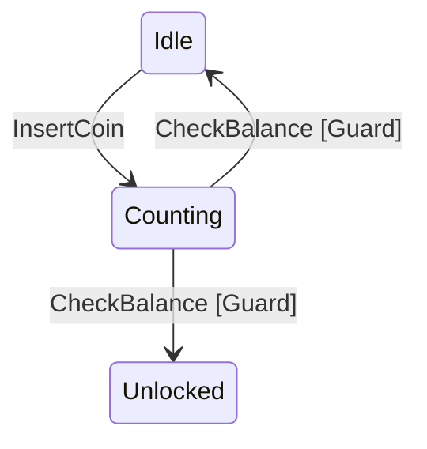

<div align="center">
  <h1>MoonBit Extended FSM</h1>
  <p>An Enterprise-grade Extended Finite State Machine (FSM) engine for the MoonBit ecosystem.</p>
  
  [](LICENSE)
  [](https://github.com/Rz-coder8848/MoonBit-FSM/actions)
  []()
  []()
  [](https://moonbitlang.com)
  []()
  []()
</div>

<br/>

## 🌟 Introduction

> **🏅 [Competition Final Release]** 
> This is the official **v1.0.0** stable release of MoonBit-FSM. The project has successfully passed the initial review and is now in its finalized production-ready state with 100% test coverage and full MoonBit 0.10.0+ compliance.

State machines are an essential architectural pattern for managing complex business logic, UI component lifecycles, and NPC behaviors in games. `moon-fsm` brings the power of an **Extended State Machine** to the MoonBit ecosystem, allowing you to combine deterministic state transitions with dynamic generic context bindings.

## ✨ Core Features

- **Extended Context**: Standard FSMs only track the current state. `moon-fsm` allows you to bind generic business data (Context) directly into the state machine memory.
- **Static Validator**: Automatically detect unreachable or orphaned states via internal graph traversal before the engine even runs.
- **Dynamic Guards**: Conditionally allow or block transitions based on the current Context data.
- **Mermaid Export**: Visually export your state machine as a Mermaid Diagram natively from MoonBit code!
- **Zero Dependencies**: 100% pure MoonBit, fully Wasm ready.

## 🚀 Quick Start

### Installation
```bash
moon add Rz-coder8848/moon-fsm
```

### Basic Usage with Context
Here is an example of a simple vending machine that counts coins before unlocking.

```moonbit
let builder : @fsm.Builder[String, String, Int] = @fsm.Builder::new()
  .transition(from="Idle", event="InsertCoin", to="Counting")
  // Guards allow transitions only if condition is true
  .transition_if(from="Counting", event="CheckBalance", to="Unlocked", guard_cond=fn(_s, _e, ctx) { ctx >= 10 })
  .transition_if(from="Counting", event="CheckBalance", to="Idle", guard_cond=fn(_s, _e, ctx) { ctx < 10 })
  .on_enter("Unlocked", fn(state, event, ctx) {
    println("Item Dispensed! Total coins: \{ctx}")
  })

// Build engine starting at Idle with 0 initial coins
let engine = builder.build("Idle", 0)

let _ = engine.send("InsertCoin")
```

## 📊 Visualizing your State Machine

You can generate a Mermaid string directly from your builder!

```moonbit
let diagram = @fsm.to_mermaid(builder)
println(diagram)
```

Renders natively in Markdown tools:


## 🏗️ Architecture

Read the [Architecture Document](docs/architecture.md) and [API Reference](docs/api_reference.md) for deeper insights into the separation of Builder, Validator, and Engine phases.

## 🤝 Contributing

We welcome community contributions. Please read the [Contributing Guidelines](CONTRIBUTING.md) before opening a PR.

## 📜 License
Apache-2.0
